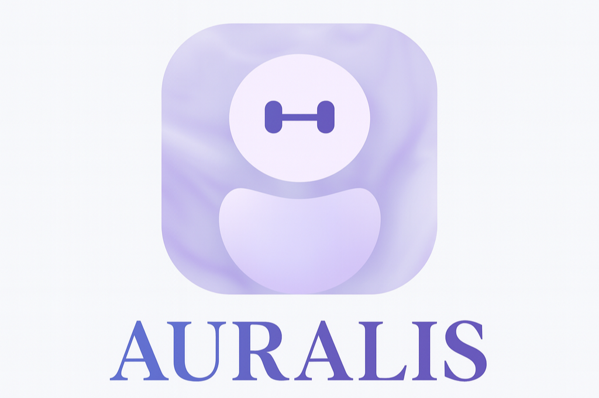

# 👋 Hi, I'm Nathan Espejo

### Software Engineering Student | Game Developer | Embedded Systems Developer

*Crafting innovative solutions that bridge hardware and software*

---

---

## 💫 About Me

**Software Engineering** student at **Western University** specializing in game development, Android apps, and embedded systems. I build immersive VR games, intuitive mobile apps, and innovative hardware prototypes that merge software with physical interaction.

---

## 🥇 Hackathon Winning Projects

<table>
<tr>
<td width="50%">

### [Auralis](https://github.com/rickytang666/auralis)
A virtual 3D healthcare assistant combining emotion detection and natural voice interaction.

**Tech:** `3D Animation` `AI` `TTS/SST`

🔗 [Live Demo](https://stop-googling-symptoms.tech) | [Devpost](https://devpost.com/software/docai-evq74t)

</td>
<td width="50%">

### [Lumen](https://github.com/Dawgsrlife/lumen)
A calming companion that listens, understands, and responds with personalized mini-games.

**Tech:** `Game Dev` `Unity` `AI Integration`

🔗 [Live Demo](https://llumen.netlify.app/) | [Devpost](https://devpost.com/software/lumen-qsgcn4)

</td>
</tr>
<tr>
<td width="50%">

### [Eyecandy](https://github.com/Duck-luv-pie/eyecandy)
An AR shopping experience that turns any product photo into a virtual try-on.

**Tech:** `AR Glasses` `Computer Vision`

🔗 [Devpost](https://devpost.com/software/eye-candy)

</td>
<td width="50%">

### [Careerly](https://github.com/she11fish/careerly)
Making career exploration fun and inclusive through an AI-powered virtual job fair.

**Tech:** `Game Dev` `Unity` `Cohere API`

🔗 [Devpost](https://devpost.com/software/career-fair-xz0f67)

</td>
</tr>
</table>

---

